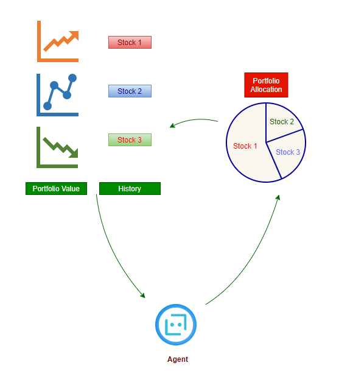
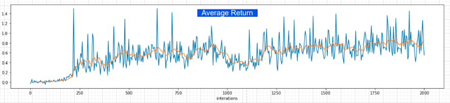
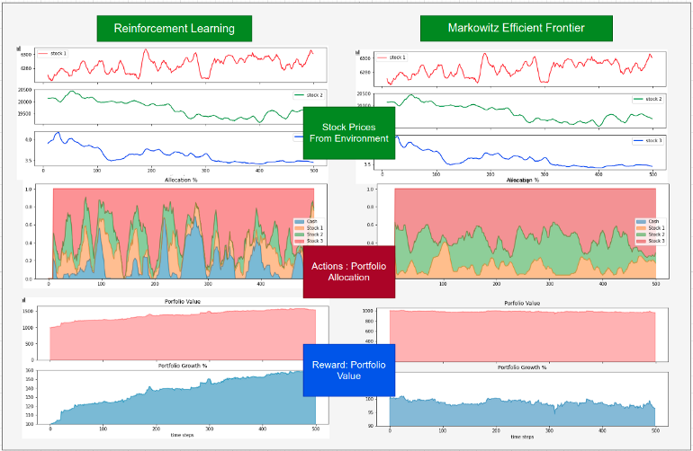

# Adaptive Portfolio Optimization using Reinforcement Learning

[](https://www.python.org/downloads/)
[](https://tensorflow.org/)
[](https://www.tensorflow.org/agents)
[](https://opensource.org/licenses/MIT)

An end-to-end framework applying Deep Reinforcement Learning (**DDPG** — Deep Deterministic Policy Gradient via **TF-Agents**) to the continuous dynamic asset allocation and portfolio optimization problem. The RL agent dynamically adjusts capital allocations across cash and volatile crypto assets (**DASH**, **LTC**, and **STR**) at 5-minute intervals, outperforming classical **Markowitz Modern Portfolio Theory (MPT)**.

---

## 📌 Problem Formulation

Traditional portfolio management relies on static or periodic mean-variance optimization (Markowitz). In high-frequency, non-stationary financial markets, market regimes shift rapidly and non-linear dynamics dominate.

We formulate portfolio management as a continuous-control Markov Decision Process (MDP):

1. **State Space ($\mathcal{S}_t \in \mathbb{R}^{42}$)**:
   - Relative intraday price ratios: High-to-Open ($v_h = H/O$), Low-to-Open ($v_l = L/O$), and Close-to-Open ($v_c = C/O$).
   - Price and volume velocity (first differences): $\Delta \text{Open}, \Delta \text{Volume}, \Delta \text{QuoteVolume}, \Delta \text{WeightedAvg}$.
   - Multi-scale rolling statistical averages across 7, 14, and 30 time windows.
   - Normalized dynamically using rolling standard scalers.

2. **Action Space ($\mathcal{A}_t \in \Delta^K$)**:
   - Continuous simplex vector representing proportional allocations across cash and available assets:
     $$\mathbf{w}_t = [w_{\text{cash}}, w_{\text{DASH}}, w_{\text{LTC}}, w_{\text{STR}}] \quad \text{such that} \quad \sum_{i=0}^{K} w_i = 1, \quad w_i \ge 0$$

3. **Reward Function ($\mathcal{R}_t$)**:
   - The immediate change in total portfolio valuation from step $t$ to $t+1$:
     $$\mathcal{R}_t = V_{t+1} - V_t$$
   - Maximizing cumulative reward naturally encourages high risk-adjusted capital growth while penalizing drawdown.

---

## 🧠 System Architecture



The policy is trained using **Deep Deterministic Policy Gradient (DDPG)**:
- **Actor Network**: Maps continuous state observations to target allocation simplex weights.
  - Multi-layer perceptron with layers `(400, 300)`.
- **Critic Network**: Evaluates the state-action value $Q(s, a)$.
  - Joint observation-action dense layers `(400, 300)`.
- **Exploration**: Ornstein-Uhlenbeck (OU) temporal correlation process ($\sigma = 0.2, \theta = 0.15$) to produce smooth, non-disruptive exploration trajectories in financial time-series.
- **Replay Buffer**: Uniform experience replay decoupling sequential autocorrelation.

---

## 📈 Results & Comparisons

### Agent Training Dynamics
The agent steadily converges towards positive average returns per episode as it discovers defensive cash allocations during downturns and aggressive exposure during momentum spikes:



### Comparison: DDPG vs. Markowitz Portfolio Theory
Comparing the cumulative portfolio trajectory against the Monte Carlo Markowitz mean-variance baseline highlights the adaptability of the RL policy:



---

## 📂 Repository Structure

```
.
├── img/                               # Architecture diagrams and performance curves
│   ├── compare.png
│   ├── mark.png
│   ├── po_model.png
│   └── training.png
├── .gitignore                         # Exclusions for checkpoints, logs, and environments
├── requirements.txt                   # Environment dependencies
├── config.py                          # Hyperparameters, feature specifications, asset tickers
├── environments.py                    # Custom Continuous Portfolio Gym/TF-Agents Environment
├── policies.py                        # Markowitz Mean-Variance Portfolio baseline
├── pre_process.py                     # Feature engineering and rolling statistics pipeline
├── generate_sample_data.py            # Synthetic market generator for out-of-the-box execution
├── train.py                           # DDPG training loop, evaluation, and policy checkpointing
├── utils.py                           # Trajectory collection and evaluation routines
└── README.md                          # Project documentation
```

---

## 🚀 Quickstart Guide

### 1. Clone the Repository
```bash
git clone https://github.com/kunalsahu3591-cyber/Adaptive-Portfolio-Optimization-using-Reinforcement-Learning.git
cd Adaptive-Portfolio-Optimization-using-Reinforcement-Learning
```

### 2. Set Up Virtual Environment & Dependencies
```bash
python -m venv venv
# On Windows:
.\venv\Scripts\activate
# On Linux/macOS:
source venv/bin/activate

pip install -r requirements.txt
```

### 3. Generate or Prepare Data
You can either place your historical 5-minute OHLCV `cleaned.csv` into the project root, or generate synthetic cryptocurrency data immediately:
```bash
python generate_sample_data.py --steps 3000
```

### 4. Run Feature Engineering
Transform the raw OHLCV price series into normalized indicators and multi-horizon rolling statistics:
```bash
python pre_process.py
```
This generates `cleaned_preprocessed.csv`.

### 5. Train the Reinforcement Learning Agent
Launch the DDPG training pipeline:
```bash
python train.py --iterations 1000 --eval-interval 10
```
- Periodic checkpoints will be saved in `model_save/`.
- Training curves and metrics will be exported to `output_img_gamma.png` and `LOGDIR/output_ar_gamma.csv`.

---

## 📊 Markowitz Baseline Evaluation

To benchmark against Markowitz Mean-Variance optimization:
```python
from policies import MarkowitzPolicy
import pandas as pd

policy = MarkowitzPolicy(n_ports=100)
# Pass recent price history window
action = policy.get_action(recent_prices_df, window=30)
print("Recommended Markowitz Allocation:", action)
```

---

## 📄 License
This project is licensed under the [MIT License](LICENSE).
